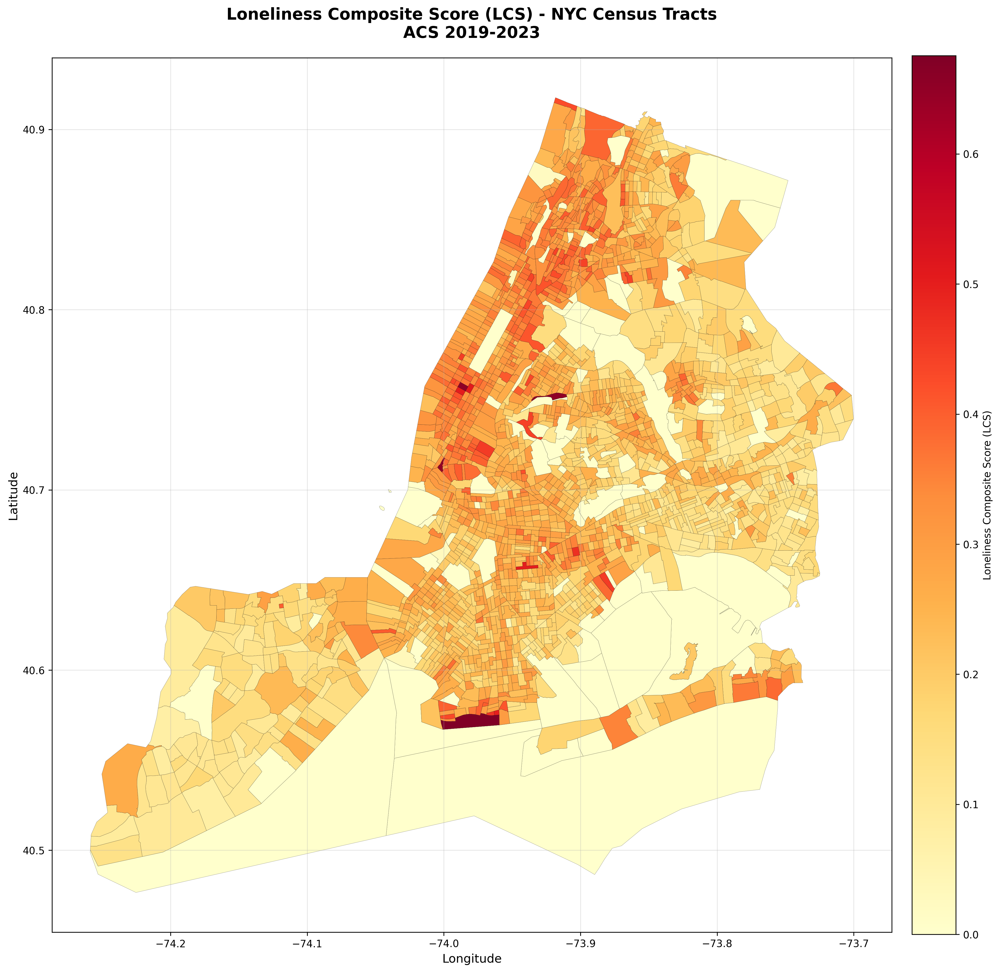
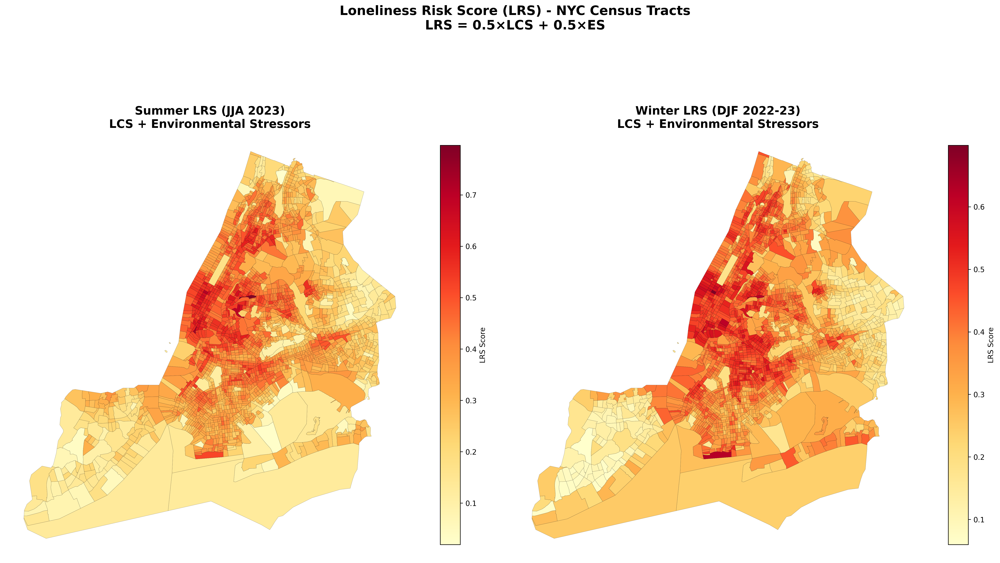
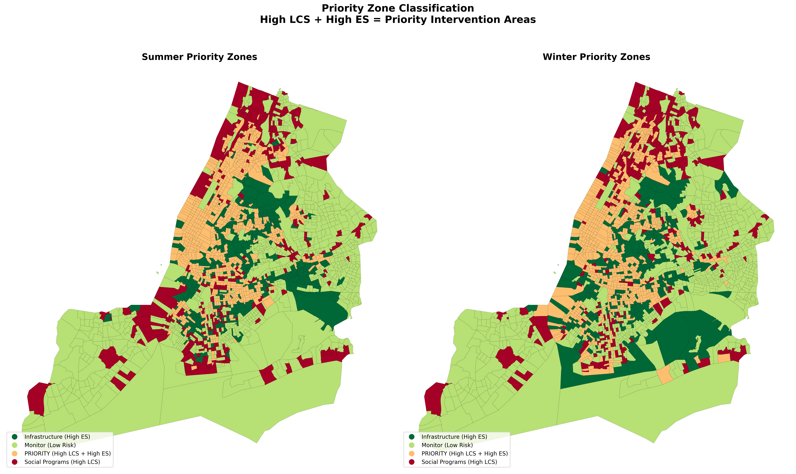

# NYC Loneliness Risk Assessment Project

Multi-Hazard Social Isolation Risk assessment for NYC's aging population (ACS 2019-2023).

## Project Structure

```
.
├── data/                              # Census and spatial data
│   ├── nhgis0008_csv/                # NHGIS ACS 2019-2023 datasets
│   └── tl_2023_36_tract/             # Tiger census tract shapefiles
├── project/                           # Jupyter notebooks & results
│   ├── 01_LCS_Loneliness_Map.ipynb   # Tier 1: Loneliness Composite Score
│   ├── 02_ES_Environmental_Stressors.ipynb  # Tier 2: Environmental Stressors
│   ├── 03_LRS_Combined_Score.ipynb   # Combined LRS & Priority Zones
│   └── results/                       # Output maps and figures
└── venv/                              # Python virtual environment
```

## Two-Tier Framework

### Tier 1: Loneliness Composite Score (LCS)
Census demographics → Baseline social isolation (6 factors)

```
LCS = (Living_Alone + Disability + Marital_Status
    + No_Vehicle + Limited_English + Poverty)×1/6
```

### Tier 2: Environmental Stressors (ES)
Satellite data → 4 factors for Summer & Winter

```
ES = (Temperature + Air_Quality + Vegetation_Lack + Light_Pollution)×1/4
```

### Output: Loneliness Risk Score (LRS)

```
LRS = (LCS + ES)×1/2
```

## Results

### LCS Map (Tier 1)


### ES 4 Factors (Tier 2)


### LRS Summer vs Winter


### Priority Zones


## Setup Instructions

### 1. Activate Virtual Environment

```bash
source venv/bin/activate
```

### 2. Start Jupyter Lab

```bash
jupyter lab
```

Run notebooks in order:
1. `01_LCS_Loneliness_Map.ipynb` → generates LCS_NYC_2023.geojson
2. `02_ES_Environmental_Stressors.ipynb` → generates ES_NYC_2023.geojson
3. `03_LRS_Combined_Score.ipynb` → generates LRS_NYC_2023.geojson & priority zones

### 3. Deactivate When Done

```bash
deactivate
```

## Data Sources

| Data | Source | Resolution |
|------|--------|------------|
| Census Demographics | NHGIS ACS 2019-2023 | Census Tract |
| Temperature | Landsat 9 LST | 100m |
| Air Quality (NO2) | Sentinel-5P TROPOMI | 1km |
| Vegetation (NDVI) | Sentinel-2 | 10m |
| Light Pollution | VIIRS DNB | 500m |
| Spatial Boundaries | TIGER/Line 2023 | Census Tract |

## Key Findings

- **High-risk clusters:** South Bronx, Upper Manhattan, Central Brooklyn
- **Seasonal variation:** Summer heat vs winter cold create different risk profiles
- **Priority zones:** ~25% of tracts need both infrastructure AND social intervention